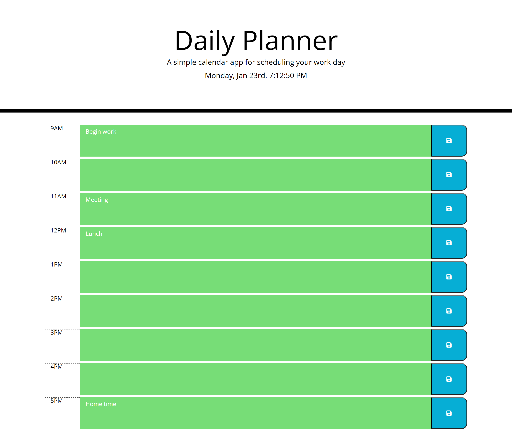

 

  <h1 align="center">Daily Planner</h1>
  

    A simple calendar application that allows a user to save events for each hour of the day.
     
    <a href="https://osmantolo.github.io/daily_planner-apis-jquery/">View Demo</a>
  

## About The Project

This repo presents a simple calendar application that allows a user to save events for each hour, and view their previously saved entries. The app will run in the browser and feature dynamically updated HTML, CSS and jQuery.

The user is presented with a hero section that uses the [Moment.js](https://momentjs.com/) to display the current day at the top of the calender when a user opens the planner library. The user is further presented with time blocks for standard business hours as they scroll down the page. The user can enter an event in any of the time blocks and saved them to the local storage of their browser by pressing the save button.

The repo serves as my solution to the Module 7 - Work Day Scheduler Challenge of Trilogy Skills Front-End Development Boot Camp. This app wil run in the browser, and will feature dynamically updated HTML and CSS powered by JavaScript. A clean responsive and accessible user interface is presented for multiple screen sizes.

The project provide evidence of my ability to analyse, manipulate, create and present dynamic data using JavaScript's Web APIs, jQuery and third party API's. The result is a user friendly web app that can be accessed by anyone with an internet connection.

## Usage

Visit this github page [link](https://osmantolo.github.io/daily_planner-apis-jquery/) to access the website. The app is web page based, so the user can interface with the controls just by clicking UI elements on the page.

## License

Distributed under the MIT License.

## Contact

Osman Dumbuya - [@OsmanTolo\_](https://twitter.com/OsmanTolo_)

Project Link: [https://github.com/OsmanTolo/daily_planner-apis-jquery](https://github.com/OsmanTolo/daily_planner-apis-jquery)

## Acknowledgments

- [Skills for Life](https://skillsforlife.campaign.gov.uk/courses/skills-bootcamps/)
- [Othneil Drew's Best-README-Template](https://github.com/othneildrew/Best-README-Template)
